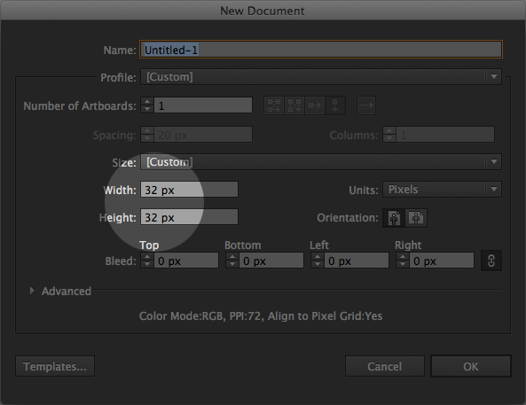
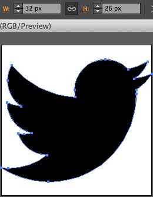
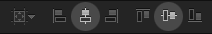
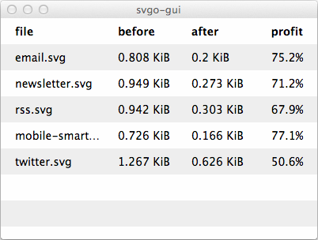

# SVG GEL Icon Set
An intermediate repository containing Production-ready SVGs from our Global Experience Language icon set. These enable Developers to produce different coloured SVGs, and PNG fallbacks for browsers that do not support them, from a single asset.

## How do I get my SVGs into this repository?
Prerequisites:
- Adobe Illustrator
- [SVGO GUI](https://raw.githubusercontent.com/simonsinclair/svg-gel-icon-set/master/support/svgo-gui.zip)

### 1/3: Preparing artwork from Adobe Illustrator
- Select and Copy `CTRL+C` your icon in its entirety.
- Create a New `CMD+N` Illustrator document using the settings for your artboard shown below:
- 
- Paste `CTRL+V` your artwork onto the new artboard, and with it still selected...
- Resize the longest edge to `32px` so that it fits within the bounds of the artboard.
- 
- Ensuring the icon is still selected, center it both vertically and horizontally to the artboard using the tool shown below:
- 

### 2/3 Saving
- Save a Copy `ALT+CMD+S` of the artwork and name it by its GEL-prescribed name.

### 3/3: Optimising
- Open SVGO GUI and drag the newly-saved file(s) onto the drop-zone. This will optimise the file(s) in-place (replacing them).
- 

Great! Please [upload your Production-ready SVGs](https://myshare.app.box.com/files/0/f/3158519203/SVG_GEL_Icon_Set) into the appropriate Box folder.

## Questions
- Neil B.
- Simon S.
