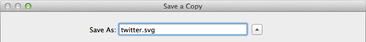
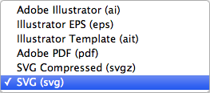
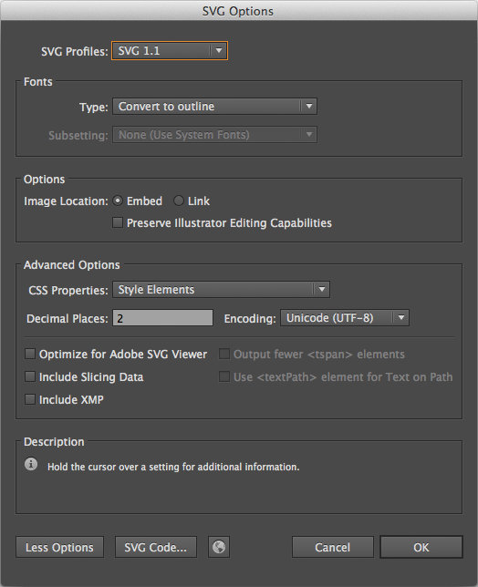

# SVG GEL Icon Set
An intermediate repository containing Production-ready SVGs from our Global Experience Language icon set. These enable Developers to produce different coloured SVGs, and PNG fallbacks for browsers that do not support them, from a single asset.

## How do I get my SVGs into this repository?
Prerequisites:
- Adobe Illustrator
- SVGO GUI [[Download]](https://raw.githubusercontent.com/simonsinclair/svg-gel-icon-set/master/support/svgo-gui.zip)

### 1/3: Preparing artwork from Adobe Illustrator
- Ensure the artwork is black *(RGB 0,0,0)* and sits on a transparent background.
- Select and Copy `CTRL+C` the icon in its entirety.
- Create a New Illustrator document `CMD+N` using the settings shown below for the new artboard:
- 
- Paste `CTRL+V` the artwork onto the new artboard, and with it still selected...
- Scale the longest edge to `32px`, being careful not to warp it, so that it fits within the artboard bounds.
- 
- Ensuring the icon is still selected, align it to the center of the artboard, both horizontally and vertically, using the Align tool:
- 

### 2/3 Saving
- Save a Copy `ALT+CMD+S` of the artwork and name it by its GEL-prescribed name:
- 
- Change the Save format to `SVG (svg)` using the dropdown:
- 
- Set the following SVG options in the panel before clicking OK:
- 

### 3/3: Optimising
- Open SVGO GUI [[Download]](https://raw.githubusercontent.com/simonsinclair/svg-gel-icon-set/master/support/svgo-gui.zip) and drag the newly-saved file(s) onto the drop-zone. This will optimise the file(s) in-place (replacing them).
- 

All done! Please [upload your Production-ready SVGs](https://myshare.app.box.com/files/0/f/3158519203/SVG_GEL_Icon_Set) into the appropriate Box folder.

## Questions?
Please contact:
- Joseph Wynn *(Technical, Implementation)*
- Neil Bramah *(Workflow, Box)*
- Simon Sinclair *(Workflow, Technical)*
